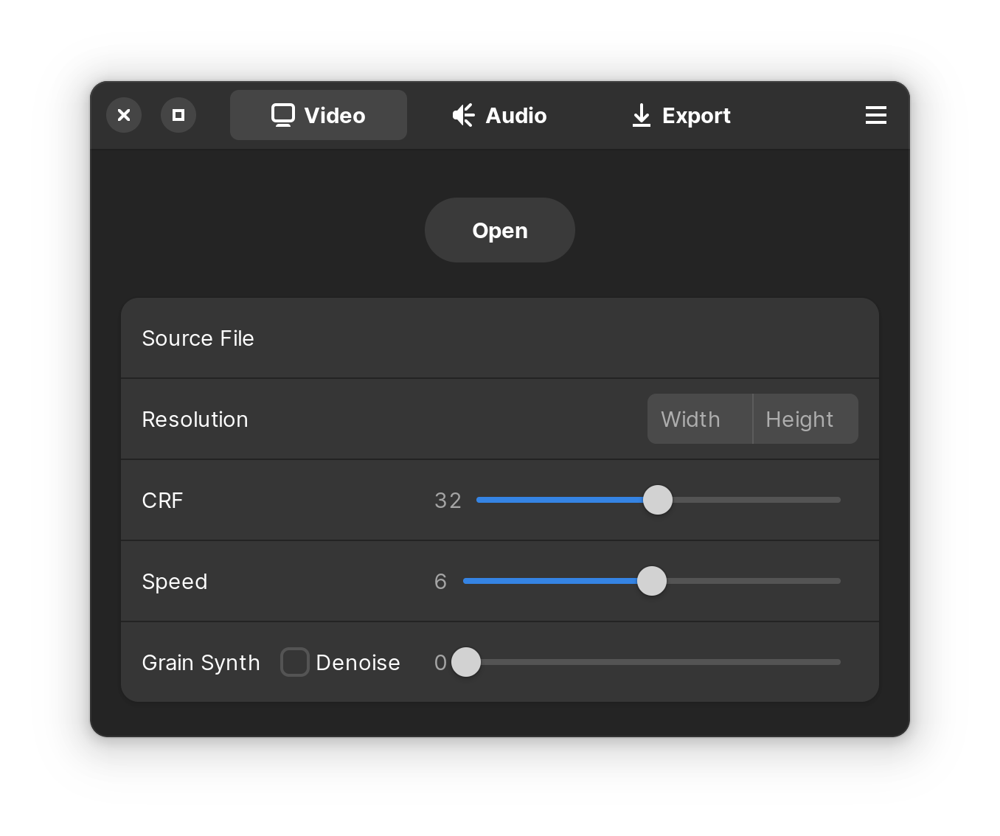
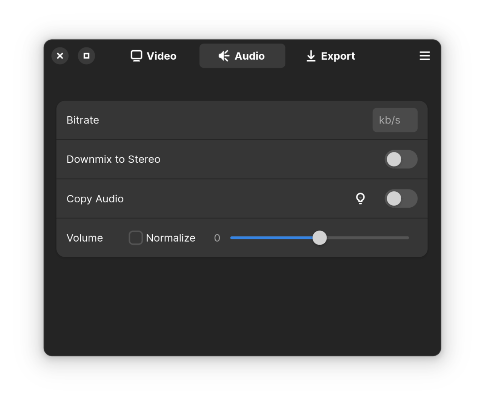
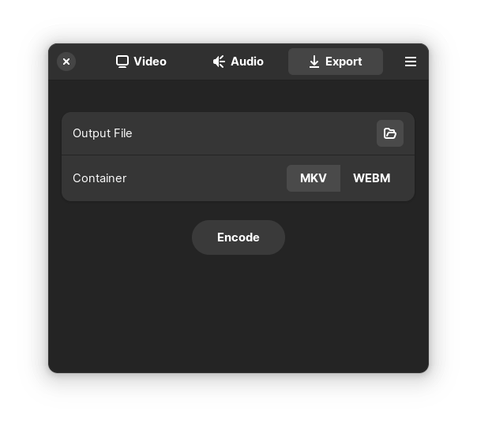

<div align="center">
<h1>Aviator</h1>

A Flatpak-first easy-to-use GUI for encoding with SVT-AV1-PSY & libopus.


<br>
<br>

[](https://flathub.org/apps/details/net.natesales.Aviator)

[](https://raw.githubusercontent.com/natesales/q/main/LICENSE)

[](https://stopthemingmy.app)
</div>

## About

Aviator enables simple & easy video encoding for the world's most advanced open video codec, AV1. Encode your favorite media into super efficient files with incredible quality per bit, powered by our custom SVT-AV1-PSY encoder with libopus for audio encoding. The sky's the limit for your old home video collection, large 4k smartphone videos, screen recordings, Blu-ray rips, you name it - take off with Aviator!

Aviator is designed to be a no frills, easy to use AV1 encoding GUI that any beginner can pick up and immediately understand how to use. 

## Installation

### Flathub

Aviator is available on Flathub. You can learn how to set up Flatpak on your distro of choice [here](https://flatpak.org/setup/).

<a href="https://flathub.org/apps/details/net.natesales.Aviator"></a>

### Building from Source

Make sure you have all required dependencies before building from source. This includes `flatpak-builder`, `python3` & `gcc`.

```bash
git clone https://github.com/gianni-rosato/aviator
cd aviator
make
```

Third party packaging formats are not officially supported by Aviator, and if you encounter bugs while using them please do not submit them as issues; we do not officially support third party packaged versions of Aviator.

## Why AV1?

[AV1](https://wiki.x266.mov/docs/video/AV1) aims to be royalty-free efficient alternative to older codecs like [H.265](https://wiki.x266.mov/docs/video/HEVC) and [H.264](https://wiki.x266.mov/docs/video/AVC).

To encode AV1 video, we've traditionally used the mainline [SVT-AV1](https://wiki.x266.mov/docs/encoders/SVT-AV1) production encoder to power scalable, fast, and feature-rich encoding in Aviator. As of early 2024, we've opted to switch to [SVT-AV1-PSY](https://github.com/gianni-rosato/svt-av1-psy) in order to maintain more control over the encoder's development and optimize for visual fidelity as much as possible. SVT-AV1-PSY promises users a fast, perceptually optimized AV1 encoder implementation that is designed to effectively take advantage of system resources.

Aviator comes bundled with its own version of FFmpeg that is capable decoding videos, upscaling & downscaling videos with the sharp Catmull-Rom scaling algorithm, & encoding audio using the Opus audio codec via libopus.

## Aviator's Defaults

Hovering over most user configurable options in Aviator will produce a helpful tooltip that you can look at to make things more clear.

### Video



By default, resolution will match your source's resolution. Manually changing one resolution value will automatically calculate the other based on the video's aspect ratio. Aviator's SVT-AV1-PSY speed preset is set to 6 by default, with a CRF (Constant Rate Factor) of 32. You can set CRF from 0 to 63 using the slider, with larger numerical values indicating smaller filesize at the expense of visual fidelity. Preset 6 offers a good balance between speed & compression efficiency at any CRF level.

The Grain Synth slider allows you to add artificial grain to your video to mimic natural grain. Grain Synth applies the artificial grain at decode time as a filter, which makes it easier to encode grainy videos at high fidelity. The Denoise switch removes noise from the video before applying artificial grain.

### Audio



Audio is reencoded even if the bitrate is set to be the same as the source audio. Audio is encoded to Opus, which is a highly efficient free audio codec that is often more better than older competitors like [AAC](https://wiki.x266.mov/docs/audio/AAC) & [MP3](https://wiki.x266.mov/docs/audio/MP3) audio. Because of Opus's incredible efficiency, audio tracks will be encoded at 80kb/s by default. Opus reaches audio transparency at around 128kb/s, which means the compressed audio will likely be impossible to distinguish from the source.

The Downmix to Stereo switch is for audio tracks with more than two channels, like 5.1 Surround or 7.1 Surround. These channels will be downmixed to a stereo output with two channels. If the input track is stereo, it isn't mixed any differently even if this option is enabled. If you know your audio is 5.1(side), you should enable this option or use Copy Audio as libopus within FFmpeg cannot handle 5.1(side)-mapped audio streams.

The Copy Audio switch disables WebM output due to potential compatibility hiccups & overrides every option on the Audio page in order to keep the source audio untouched. This option, when enabled, ensures the source audio isn't reencoded.

The Volume slider allows you to increase or decrease the output's volume. It is measured in decibles, and negative values decrease the volume. The Normalize switch allows you to normalize the audio's perceived loudness.

### Output



The container your video is stored in is associated with the file extension. Aviator offers two options for video output: the [Matroska](https://wiki.x266.mov/docs/introduction/terminology#mkv--mka--mks--mk3d) video container & the [WebM](https://wiki.x266.mov/docs/introduction/terminology#webm) container. The open-source Matroska container (.MKV) is Aviator's default container, a universal multimedia container with widespread video &amp; audio support. WebM is designed for web compatibility &amp; strips subtitles by default because of this. Both work out of the box with Aviator's AV1 video & Opus audio, but WebM output will be disabled if the Copy Audio switch is enabled because then we lose this format compliance assurance.

## Roadmap & Limitations

In the future, we would like to:
- Add a queue, potentially

Let us know if you have any issues in our Issues section. Thank you for using Aviator!

## Credits

Actively developed by [Nate Sales](https://github.com/natesales/) & [Gianni Rosato](https://github.com/gianni-rosato/)
