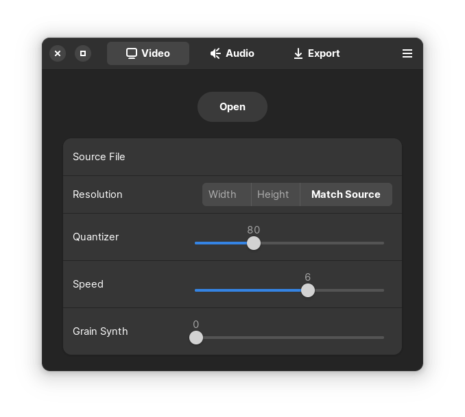
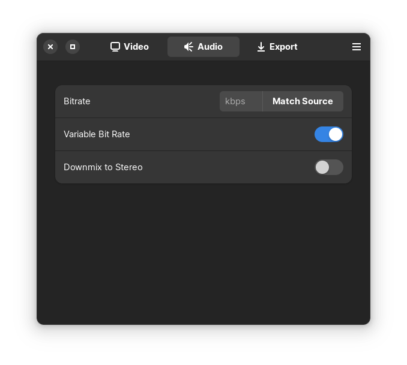
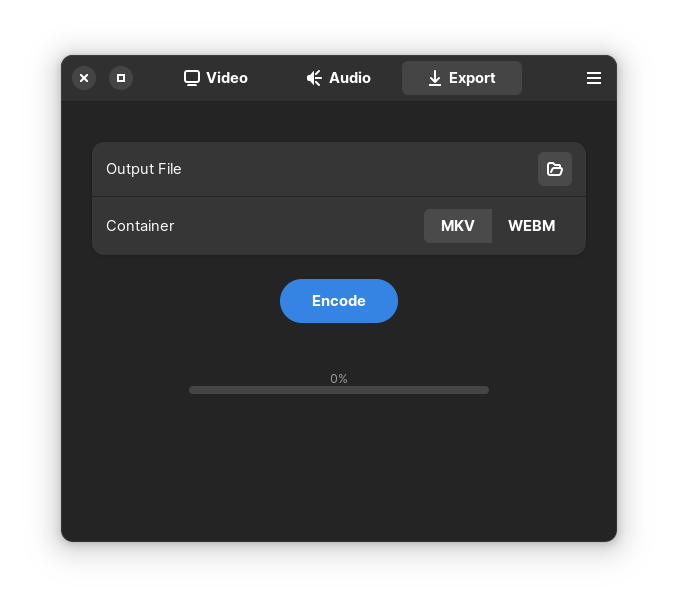

<div align="center">
<h1>rAV1ator</h1>

A Flatpak-first easy-to-use GUI for encoding with rav1e & libopus.


<br>
<br>

[](https://raw.githubusercontent.com/natesales/q/main/LICENSE)

[](https://stopthemingmy.app)
</div>

## About

rAV1ator enables simple & easy video encoding for the word's most advanced open video codec, AV1. Encode your favorite media into super efficient files with incredible quality per bit, powered by the fast, memory-safe rav1e encoder with libopus for audio encoding. The sky's the limit for your old home video collection, large 4k smartphone videos, screen recordings, Blu-ray rips, you name it - take off with rAV1ator!

rAV1ator is designed to be a no frills, easy to use AV1 encoding GUI that any beginner can pick up and immediately understand how to use. 

## Installation

### Repo

rAV1ator is available in my personal Flatpak repository. Given you have Flatpak on your system, you can install it by running:

```
flatpak --user remote-add --no-gpg-verify project-volo https://giannirosato.com/repo
flatpak --user install project-volo net.natesales.rAV1ator
```

### Building from Source

Make sure you have all required dependencies before building from source. This includes `flatpak-builder`, `python3` & `gcc`

```bash
git clone https://github.com/gianni-rosato/aviator/ -b rAV1ator
cd aviator
make
```

Third party packaging formats are not officially supported by rAV1ator, and if you encounter bugs while using them please do not submit them as issues.

## Why AV1?

AV1 aims to be more efficient than HEVC & VP9 by around 30%, and more efficient than h.264 by 50%. Traditionally, a lot of AV1 encoder implementations have been pretty slow compared to competing codecs' encoders, but the Rust-based [rav1e](https://github.com/xiph/rav1e) encoder has seen decent increases in speed recently and is improving more every day. We decided to use rav1e in order to give users a memory-safe AV1 encoder implementation that prioritizes visual quality &amp; "just works," for the most part.

One downside of rav1e is that despite being generally quicker than the libaom AV1 reference encoder, it is quite a bit slower than the SVT-AV1 production encoder. To combat this while maintaining high visual quality, rAV1ator utilizes a tool called [Av1an](https://github.com/master-of-zen/Av1an) that is capable of detecting scene changes in a video & splitting the video into multiple shorter videos (chunks) based on those scene changes, then encoding these chunks in parallel. This works especially well with longer videos. rAV1ator will determine the number of chunks to use based on Av1an's internal chunk allocator, which calculates the number of chunks your system can handle based on your logical CPU cores & the amount of RAM you have available. Encoding speed scales with the number of chunks you have, so more chunks is faster but harder on your CPU & memory.

rAV1ator comes bundled with its own version of ffmpeg that is capable decoding videos to detect source information, upscaling & downscaling videos with a sharp scaling algorithm called lanczos, & encoding audio using the Opus audio codec via libopus.

## Why no Flathub?

Flathub doesn't allow us to use the network at build time to build our dependencies, which makes it impossible to build our app. If you'd prefer, our other app called [Aviator](https://github.com/gianni-rosato/aviator) is available on Flathub with a different encoding framework based on SVT-AV1 & FFmpeg instead of rav1e & Av1an. You can check it out [here](https://beta.flathub.org/apps/net.natesales.Aviator).

## rAV1ator's Defaults

Hovering over most user configurable options in rAV1ator will produce a helpful tooltip that you can look at to make things more clear.

### Video



When you load a video file into rAV1ator, resolution & audio bitrate are set to match the source as closely as possible. rAV1ator's rav1e speed preset is set to 6 by default, with a default Quantizer level of 80. You can set the Quantizer level from 1 to 255 using the slider, with larger numerical values indicating smaller filesize at the expense of visual quality. Speed 6 offers a good balance between speed & compression efficiency at any Quantizer level; higher values will encode faster at the expense of visual quality, while lower values will encode more efficiently but more slowly.

The Grain Synth slider allows you to add artifical grain to your video to mimic its natural grain, which applies the artificial grain at decode time as a filter which makes it easier to encode grainy videos at high fidelity. The grain levels are based on ISO noise, so 1 would be equal to ISO 100, 24 equal to ISO 2400, etc.

### Audio



Audio is reencoded even if the bitrate is set to be the same as the source audio. Audio is encoded to Opus, which is a highly efficient free audio codec that is often more efficient than competitors like AAC & MP3 audio. Because of Opus's incredible efficiency, audio tracks will be encoded at 48kbps if no source bitrate is detected. Opus reaches audio transparency at around 128kbps.

### Output



The container your video is stored in is associated with the file extension. rAV1ator offers two options for video output: the Matroska video container & the WebM container. The open-source Matroska container (.MKV) is rAV1ator's default container, a universal multimedia container with widespread video &amp; audio support. WebM is designed for web compatibility &amp; may break subtitles. Both work out of the box with rAV1ator's AV1 video & Opus audio formats.

## Roadmap & Limitations

Currently, rAV1ator cannot handle:
- Video streams with subtitles encoding to .webm

These are considered bugs, and we are working on fixing them ASAP. In the meantime, we'd prefer you choose the .mkv container if you are having trouble with subtitles.

In the future, we would like to:
- Add a queue, potentially
- Add an option to copy your audio without reencoding (that disables WebM output)
- Revamp outputting a file

Let us know if you have any issues in our Issues section. Thank you for using rAV1ator!

## Credits

Actively developed by [Nate Sales](https://github.com/natesales/) & [Gianni Rosato](https://github.com/gianni-rosato/)
